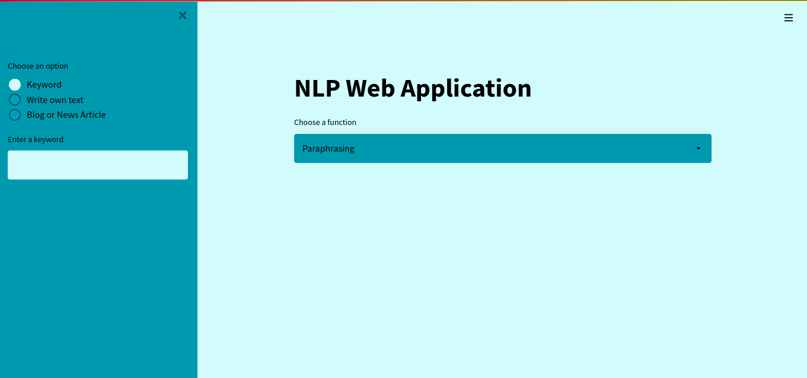
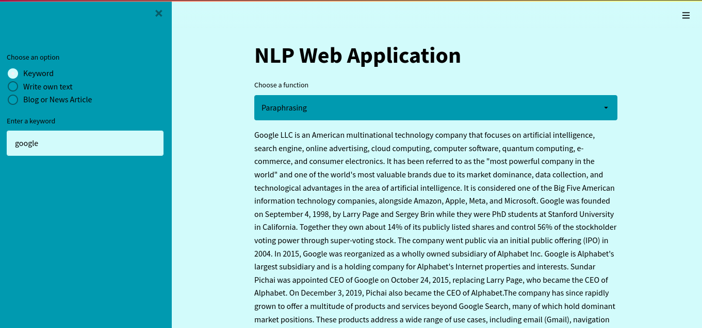
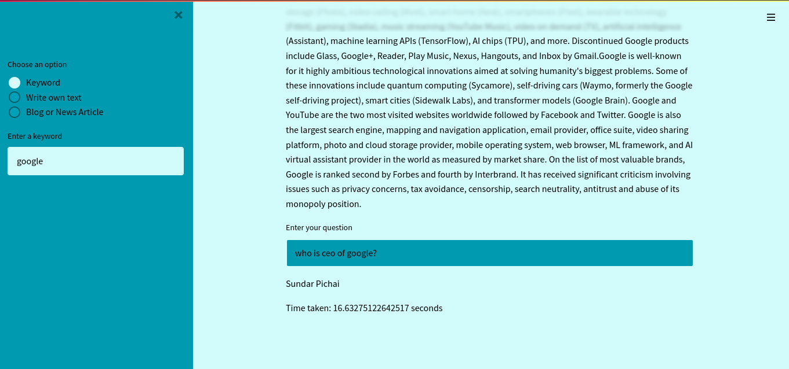
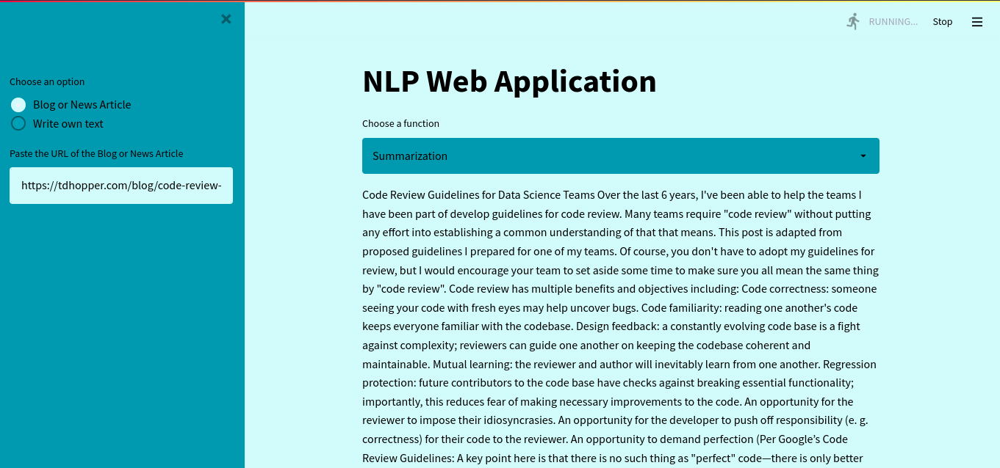
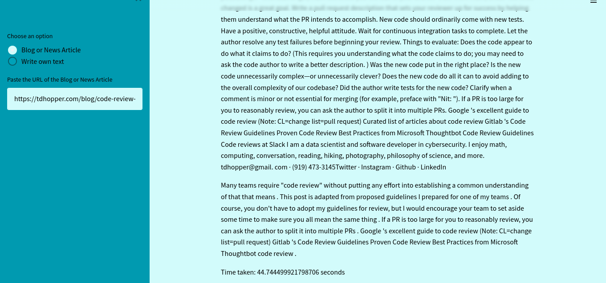

# QA Summerization

### This is a QA and summerization Web App built on Streamlit that allows you to quickly and easily create a Paraphrasing and summerization of your QA data.
---
### The main features of the app are:
1. Paraphrasing
2. Summerization

## Paraphrasing
---

Paraphrasing is the process of taking a dataset and creating a new dataset that is more relevant to the user. Here, This project allows you to provide the dataset in three different ways: 
1. Keyword
    - In Keyword mode, you can provide a keyword and the app will automatically search for the relevant data in wikipedia and Extract the data by using wikipedia API.
2. Write your own data
    - In Write your own data mode, you can write your own data and the app will automatically extract the data by using wikipedia API.
3. URL of the Blog/News Article
    - In URL mode, you can provide the URL of the blog/news article and the app will automatically extract the data by using Request API and BeautifulSoup API.

## Summerization
---

Summerization is the process of summarizing the data by reading the data you have provided. Here, This project allows you to provide the dataset in three different ways: 

1. Write your own data
    - In Write your own data mode, you can write your own data and the app will automatically extract the data by using wikipedia API.
2. URL of the Blog/News Article
    - In URL mode, you can provide the URL of the blog/news article and the app will automatically extract the data by using Request API and BeautifulSoup API.

## Models:
---
1. [Paraphrasing](https://huggingface.co/deepset/roberta-base-squad2)
2. [Summerization](https://huggingface.co/sshleifer/distilbart-cnn-12-6)

## Installation:
---

Git Clone:

```
git clone https://github.com/Surya-Teja-Menta/QA_Summerization.git
```
Requirements:
```
pip install -r requirements.txt
```
Run the app:
```
streamlit run app.py
```

## Output:
---
- start the app by running the above command.You can see the output in the browser. You have to choose between Paraphrasing and Summerization. The default mode is Paraphrasing.<br>
<center></center>

- You can choose the mode by clicking on radio button and provide the input. <br>
<center></center>

- You will get output in paraphrasing mode after asking question. <br>
<center></center>

- In the same way you can choose in summerization mode. lets take blog/news article mode <br>
<center></center>

- You will get output in summerization mode after asking question. <br>
<center></center>

## Note:
- You can select the different types of models using pipeline, if you didn't select the pipeline, the default model will be used.


---
Happy Coding!


